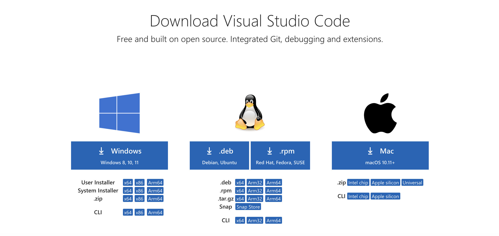
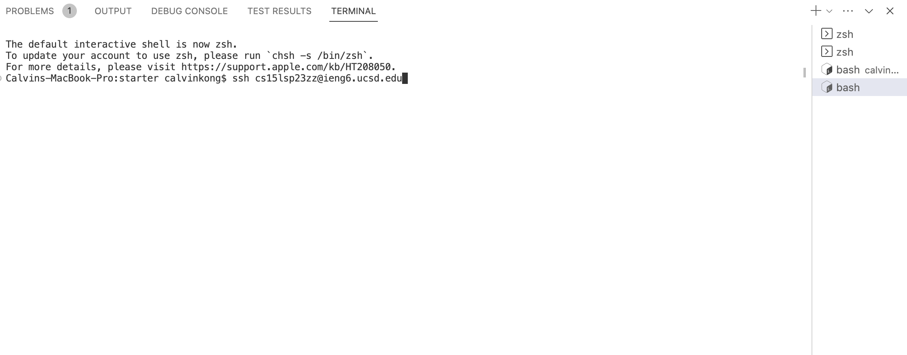
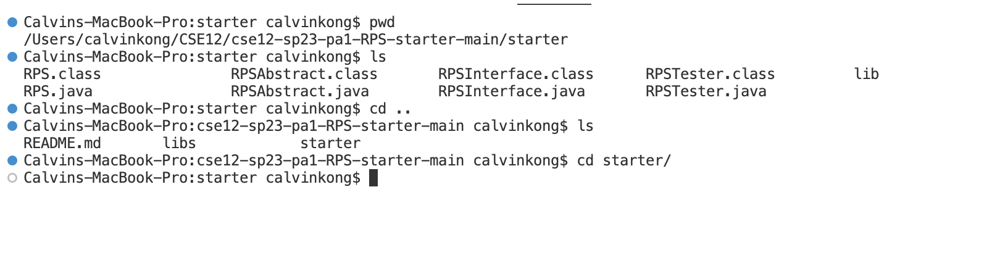

# Remote Access Tutorial

## Installing VS Code

1. Choose the correct version of VS Code based on your device
2. Download Zip and after unzipping, you would be able to open the application and use VS Code on your device 

## Remotely Connecting

1. Open new terminal on VS Code and on the right hand side you can change the shell to bash.
2. Type the command ssh followed by your ieng6 username.
3. After typing in your password you will be remotely connected. 

## Example Commmands 

1. pwd shows your current directory
2. ls lists all files and directories in your current directory
3. cd [directory] changes your current directory to the specified directory

